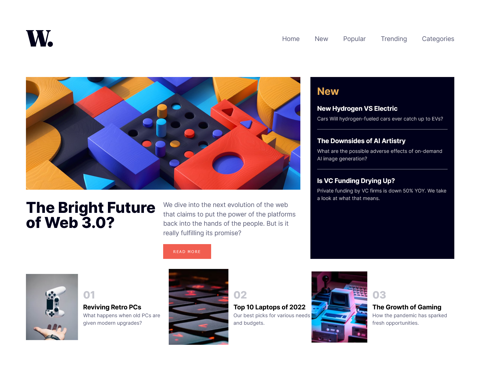
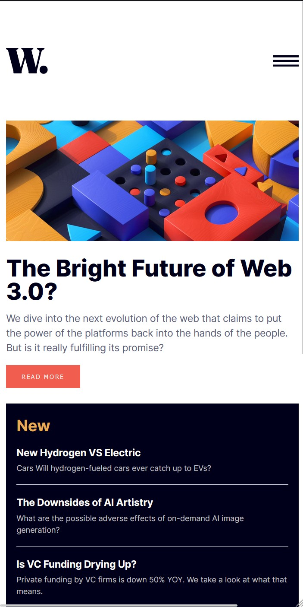
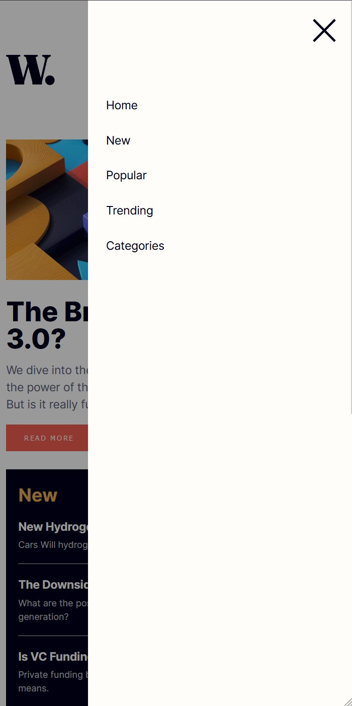

# Frontend Mentor - News homepage solution

This is a solution to the [News homepage challenge on Frontend Mentor](https://www.frontendmentor.io/challenges/news-homepage-H6SWTa1MFl). 

### The challenge

Users should be able to:

- View the optimal layout for the interface depending on their device's screen size
- See hover and focus states for all interactive elements on the page

### Screenshot

### Links

- Live Site URL: [Add live site URL here](https://yvnvs.github.io/news-homepage/)

### Built with

- Semantic HTML5 markup
- CSS custom properties
- Flexbox
- CSS Grid
- Mobile-first workflow

### What I learned

Building responsive websites has become an essential skill in today's digital landscape. Responsive design allows websites to adapt to different screen sizes, providing an optimal viewing experience for users on all devices. To create a responsive site, one must have a good understanding of HTML, CSS and JavaScript. Knowledge of frameworks such as Bootstrap and Foundation can also be useful.

Hamburger menus, commonly used in responsive design, are toggleable navigation buttons that appear as a three-line icon on smaller screens. They allow easy access to a site's main navigation, helping to keep the design clean and uncluttered. Creating a hamburger menu requires a basic understanding of HTML, CSS and JavaScript. With these skills and a little creativity, one can create a functional and aesthetically pleasing hamburger menu for any website.

- Frontend Mentor - [@yourusername](https://www.frontendmentor.io/profile/yvnvs)
